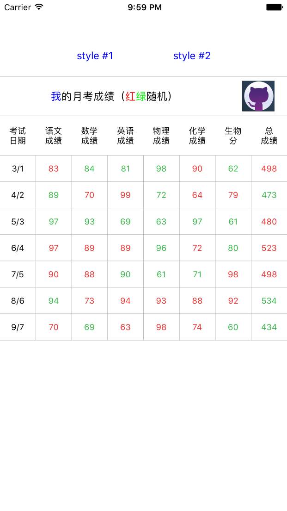

# JXMultipleColumnsTableView
A multiple columns table view based on CoreGraphics framework.




## Installation

### CocoaPods
JXMultipleColumnsTableView is available through [CocoaPods](http://cocoapods.org). To install it, simply add the following line to your Podfile, and then import `<JXMultipleColumnsTableView/JXMultipleColumnsTableView.h>`:

```ruby
pod 'JXMultipleColumnsTableView'
```

### Manually

1. Download the project and drop `JXMultipleColumnsTableView` folder into your project;
2. Import file `JXMultipleColumnsTableView.h`.

## How to use

Please refer to the demo.

## Author
**Amos King** *email: wangjiuxing2010@hotmail.com*

## License
JXMultipleColumnsTableView is released under MIT license. See LICENSE for details.

